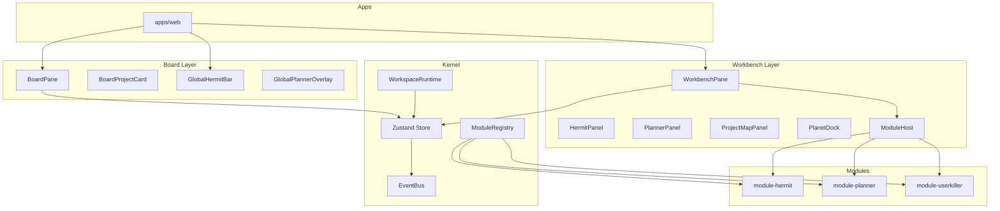

# Chariot 架构

## 总体架构

## Board / Workbench / Kernel / Modules 的关系

- **Board**：外层空间，展示全部项目卡片，底部有 Global Hermit 输入框。未来由 Tia 实现完整画布视觉。
- **Workbench**：内层空间，打开某个项目后进入。包含 HermitPanel、PlannerPanel、ProjectMapPanel、PlanetDock。
- **Kernel**：全局状态（projects、workspaces、activeIds）、事件总线、模块注册表、workspace 运行时。
- **Modules**：hermit、planner、userkiller 三个内建模块，通过 ModuleRegistry 注册，ModuleHost 根据 activeWorkbenchModule 渲染。

## Hermit 双作用域

- **board scope**：`buildBoardHermitContext()`、`runHermitInBoardScope(question)` — 基于全部项目做全局嗅探。
- **project scope**：`buildWorkspaceHermitContext(workspaceId)`、`runHermitInProjectScope(workspaceId, question)` — 基于当前 workspace 工作。

## Planner 双作用域

- **global scope**：`buildGlobalPlanningSnapshot()`、`detectGlobalConflicts()` — 跨项目排程与冲突。
- **project scope**：`buildProjectPlanningSnapshot(workspaceId)`、`detectProjectConflicts(workspaceId)` — 当前项目排程与冲突。

## 为什么先统一模型再统一功能

第一阶段重点：定义 ChariotProjectCard、ChariotWorkspace、SniffSnapshot、PlannerSnapshot、ChariotModuleManifest、ChariotEvent 等共享类型。这些 contract 是后续从 HERMIT、emergency-planner 抽取能力的基础。先让骨架跑通，再逐步接入真实能力。
