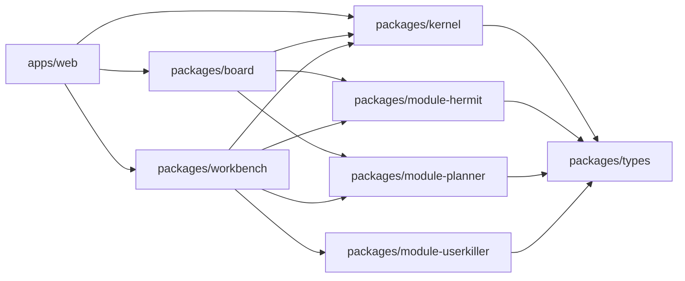

# Chariot Architecture

## 总体结构

Chariot 当前是一个统一前端壳，而不是三个应用的拼装页。

运行中的主结构如下：

## 运行中的界面分区

### Board

左侧是 `BoardPane`。

它当前负责：

- 展示 `ProjectCard`
- 承担全局项目切换入口
- 显示全局 Planner overlay
- 承担底部 `Global Hermit` 的 board-scope 入口

它当前不负责：

- 完整视觉系统
- post-it 动画
- 复杂画布交互

### Workbench

右侧是 `WorkbenchPane`。

它当前负责：

- 显示当前 active project / workspace
- 展示 `ProjectMapPanel`
- 展示 `HermitPanel`
- 展示 `PlannerPanel`
- 通过 `PlanetDock` + `ModuleHost` 暴露 `Userkiller` 入口

## Kernel 的角色

`packages/kernel` 是当前壳层的运行核心。

它负责：

- Zustand store
- 事件总线
- module registry
- workspace runtime
- snapshot sync helpers

当前 store 最关键的状态是：

- `projects`
- `workspaces`
- `activeProjectId`
- `activeWorkspaceId`
- `activeWorkbenchModule`
- `globalHermitInput`

## Board / Workbench / Modules 的关系

### Board -> Kernel

Board 通过 runtime 打开项目并切换当前 workspace。

### Workbench -> Kernel

Workbench 从 kernel 读取 active project / workspace，并在同一套状态上渲染 Hermit、Planner 和 ModuleHost。

### Modules -> Kernel

模块当前不直接控制页面，而是通过 manifest、snapshot builder、runner 和 adapter contract 为壳层供给能力。

## Hermit 双作用域

当前已经为两种作用域留好入口：

- `board scope`
  - 入口：`GlobalHermitBar`
  - builder：`buildBoardHermitContext()`
  - runner：`runHermitInBoardScope()`

- `project scope`
  - 入口：`HermitPanel`
  - builder：`buildWorkspaceHermitContext(workspaceId)`
  - runner：`runHermitInProjectScope(workspaceId, question)`

这意味着后续接入真实 HERMIT 能力时，不会把认知逻辑绑死在“当前项目唯一上下文”上。

## Planner 双作用域

Planner 也按两种作用域拆开：

- `global scope`
  - 入口：`GlobalPlannerOverlay`
  - builder：`buildGlobalPlanningSnapshot()`
  - detector：`detectGlobalConflicts()`

- `project scope`
  - 入口：`PlannerPanel`
  - builder：`buildProjectPlanningSnapshot(workspaceId)`
  - detector：`detectProjectConflicts(workspaceId)`

这样后续可以让 Board 做跨项目冲突感知，让 Workbench 做项目内排程解释。

## 为什么先统一模型再统一功能

当前阶段不追求完整业务，而追求稳定的共享 contract。

原因很简单：

- 三个源项目的数据模型并不一致
- 页面直接复用会把旧假设一起带进来
- UI 先行会把壳层绑死在旧页面结构上

因此第一阶段的优先级是：

1. 统一 `ProjectCard / Workspace / Snapshot / Event / Module Manifest`
2. 建好 `Kernel`
3. 建好可运行壳层
4. 再逐步把真实能力从源项目抽进来
