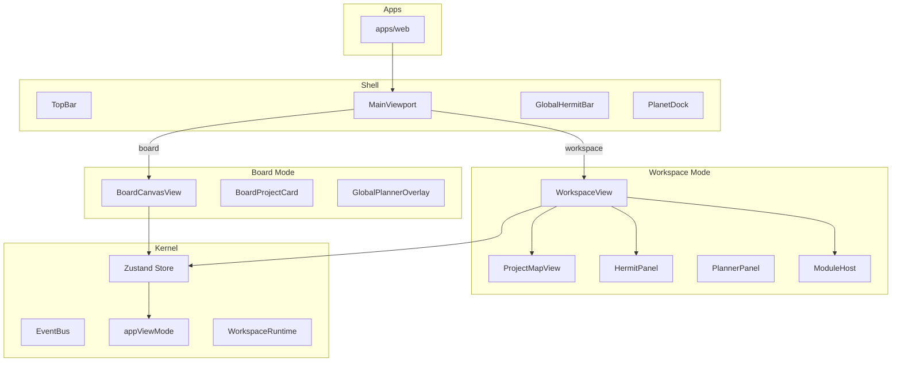

# Chariot 架构

## 空间模型（非 dashboard）

Chariot 是统一空间界面，不是左右平铺的后台管理界面：

- **Board** = 全局画布，不是 sidebar。项目对象散布在画布上。
- **Project Map** = 局部地图主区域，不是辅助信息卡。在 Workspace Mode 中占据中央。
- **Hermit** = 系统认知层：Global Hermit Bar（底部常驻）+ Workspace Hermit 面板，不是单个输入框。
- **Planner** = 系统约束层：Global Planner Overlay（Board 模式）+ Project Planner Panel（Workspace 模式），不是单页 tab。

## 总体架构

## Board Mode 与 Workspace Mode

- **Board Mode**（默认）：MainViewport 渲染 BoardCanvasView。画布上散布项目节点，右下角 Global Planner Overlay。点击项目进入 Workspace Mode。
- **Workspace Mode**：MainViewport 渲染 WorkspaceView。Project Map 主区域，Workspace Hermit 右侧常驻，Planet Dock 切换 Planner/Userkiller。底部 Global Hermit Bar 常驻。Back to Board 返回。

## Board / Workspace / Kernel / Modules 的关系

- **Board**：全局画布，项目对象散布，非侧边列表。Global Planner Overlay 显示全局冲突与建议。
- **Workspace**：进入项目后的空间。Project Map 占据主区域，Workspace Hermit 常驻，Planner/Userkiller 为次级模块。
- **Kernel**：appViewMode（board | workspace）、projects、workspaces、activeIds、事件总线、模块注册表。
- **Modules**：hermit、planner、userkiller 通过 ModuleRegistry 注册。Planet Dock 为模块轨道切换器，非 tab bar。

## Hermit 双作用域

- **Global Hermit Bar**：底部常驻，Board/Workspace 模式均存在。Board 模式下回答全局问题。
- **Workspace Hermit 面板**：Workspace 模式中基于当前 project map / sniff 工作，显示 context、suggestions、mock 回答。

## Planner 双作用域

- **Global Planner Overlay**：Board 模式中 overlay/inspector，显示全局冲突数、建议、受影响项目。
- **Project Planner Panel**：Workspace 模式中次级模块面板，显示当前项目冲突与建议。

## 为什么先统一模型再统一功能

第一阶段重点：定义 ChariotProjectCard、ChariotWorkspace、SniffSnapshot、PlannerSnapshot、ChariotModuleManifest、ChariotEvent 等共享类型。Board 与 Project Map 共享 MapNode 基础模型。这些 contract 是后续从 HERMIT、emergency-planner 抽取能力的基础。
